# Portaflio de inversiones usando análisis de sentimientos y redes LSTM

### Proyecto final de la materia de Procesamiento de Lenguaje Natural

---

## Descripción

Este proyecto final tiene como objetivo predecir el precio de acciones utilizando un modelo de red neuronal LSTM (Long Short-Term Memory) entrenado con datos financieros históricos y análisis de sentimientos extraídos de noticias. El proyecto incluye el uso de datos financieros y noticias de Yahoo Finance, reacciones de la red social reddit y análisis de sentimientos utilizando la herramienta VADER.


---

**Autor**: Gustavo Recalde  
**Fecha**: Septiembre 2024  
**Universidad**: Universidad San Fransisco de Quito 

**Enlaces**:  
- [Repositorio completo en GitHub](https://github.com/grecalde17gh/pln-lstm-stock-prediction)
- [Notebook en Google Colab](https://colab.research.google.com/github/grecalde17gh/pln-lstm-stock-prediction/blob/main/Portafolio_de_inversiones_v6.ipynb)

---

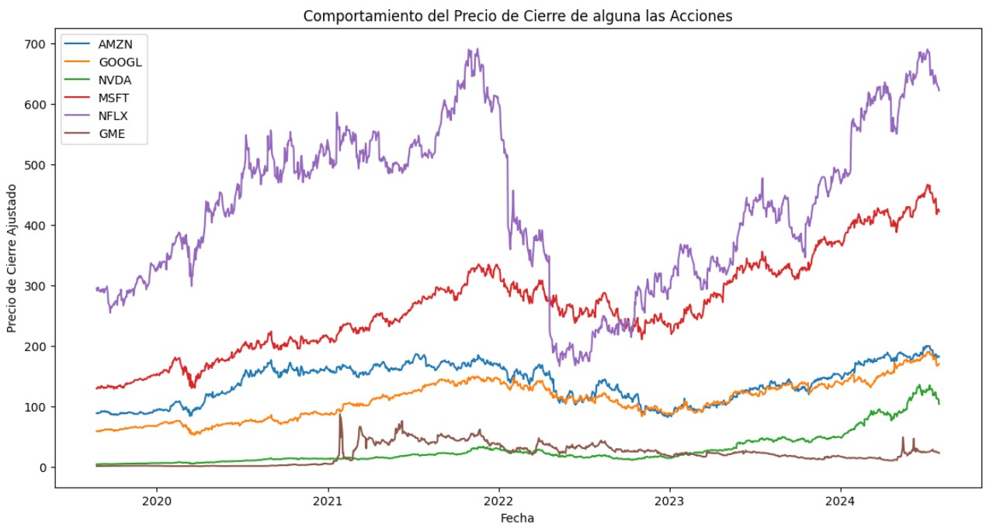

## Introducción

La predicción de precios de acciones es un desafío clave en las finanzas debido a la naturaleza compleja y volátil de los mercados. En este proyecto, se utiliza una combinación de datos financieros históricos y el análisis de sentimientos basado en noticias para mejorar la precisión de las predicciones.

El modelo principal es una red LSTM, adecuada para el análisis de series temporales. Además, se incorporan técnicas de procesamiento de lenguaje natural (PLN) para analizar el sentimiento de las noticias financieras y medir su impacto en los precios de las acciones.

Los principales objetivos del proyecto son:

1. **Predecir el precio de acciones** utilizando una red LSTM basada en datos históricos de precios y volúmenes.
2. **Incorporar análisis de sentimientos** de noticias relacionadas con las empresas seleccionadas para mejorar la predicción.
3. **Comparar el rendimiento** de un modelo basado únicamente en datos financieros versus uno que también incluye datos de sentimientos.


## Preparación de Datos

### DATSET

Este proyecto utilizó datos financieros históricos de seis acciones principales, así como noticias y comentarios de Reddit para realizar el análisis de sentimientos. A continuación se describen las fuentes de datos utilizadas:

- **Yahoo Finance**: Se extrajeron datos de los precios históricos ajustados y el volumen de transacciones para los siguientes seis tickers:
  - **AMZN** (Amazon.com Inc.)
  - **GOOGL** (Alphabet Inc.)
  - **NVDA** (NVIDIA Corporation)
  - **AAPL** (APPLE)
  - **NFLX** (Netflix Inc.)
  - **GME** (GameStop Corp.)

  Los datos financieros abarcan el período desde **enero de 2020 hasta enero de 2023**, un rango que cubre eventos relevantes como la pandemia de COVID-19 y el auge de las "acciones meme" como GameStop.

- **Medias Móviles**: Se incluyeron medias móviles simples (SMA) en el análisis técnico. Las medias móviles se calcularon sobre periodos de 10, 30 y 60 días para ayudar a suavizar las fluctuaciones a corto plazo y captar las tendencias más amplias en los precios de las acciones. Estas medias se utilizaron como indicadores adicionales en el modelo para mejorar la capacidad predictiva.

- **Análisis de Sentimientos de Noticias**: Se recopilaron noticias relacionadas con las empresas mencionadas y se analizaron utilizando **VADER** para generar puntuaciones de sentimiento (positivo, negativo, neutral y compuesto). Estas puntuaciones se integraron con los datos financieros para evaluar su impacto en las predicciones de precios.

- **Comentarios de Reddit**: Además de las noticias, también se recopilaron comentarios de la red social **Reddit** en subreddits relacionados con el mercado de valores. Los comentarios de Reddit proporcionaron una perspectiva adicional sobre el sentimiento popular y se analizaron utilizando **VADER** para extraer puntuaciones de sentimiento, que también se integraron en el modelo.

### Extracción de Datos Financieros

Para extraer los datos financieros históricos, se utilizó la biblioteca `yahoo_fin`. :

```python
# Lista de tickers
tickers = ['AMZN', 'GOOGL', 'NVDA', 'MSFT', 'NFLX']

# Descargar datos de Yahoo Finance para cada ticker
def download_data(ticker):
    data = yf.download(ticker, start='2019-06-01', end='2024-07-31')
    data['MA_10'] = data['Adj Close'].rolling(window=10).mean()
    data['MA_30'] = data['Adj Close'].rolling(window=30).mean()
    data['MA_60'] = data['Adj Close'].rolling(window=60).mean()
    data.dropna(inplace=True)  # Eliminar filas con valores NaN debido al cálculo de medias móviles
    return data
```

## Modelo de LSTM para la Predicción de Precios

### Estructura del Modelo

El modelo LSTM se implementó utilizando `PyTorch Lightning` para facilitar la gestión del entrenamiento y el seguimiento de las métricas de rendimiento. La red está diseñada para predecir el precio de cierre ajustado de las acciones basadas en datos históricos y análisis de sentimientos.

```python
class LSTMModel(pl.LightningModule):
    def __init__(self, input_size=4, hidden_layer_size=100, output_size=1, lr=0.001):
        super(LSTMModel, self).__init__()
        self.hidden_layer_size = hidden_layer_size
        self.lstm = nn.LSTM(input_size, hidden_layer_size, batch_first=True)
        self.linear = nn.Linear(hidden_layer_size, output_size)
        self.lr = lr
        self.criterion = nn.MSELoss()

    def forward(self, x):
        lstm_out, _ = self.lstm(x)
        predictions = self.linear(lstm_out[:, -1])
        return predictions

    def training_step(self, batch, batch_idx):
        x, y = batch
        y_hat = self(x)
        loss = self.criterion(y_hat, y)
        self.log('train_loss_epoch', loss, prog_bar=True, on_epoch=True, on_step=False)
        return loss

    def configure_optimizers(self):
        return torch.optim.Adam(self.parameters(), lr=self.lr)
```

###  Entrenamiento del Modelo
El entrenamiento se realizó durante 20 épocas utilizando optimización Adam y la función de pérdida de error cuadrático medio (MSE).

```python
        # Entrenamiento del modelo
        model = LSTMModel()
        loss_logger = LossLogger()
        trainer = pl.Trainer(max_epochs=20, logger=False, callbacks=[loss_logger])
        trainer.fit(model, train_loader)

        # Guardar el modelo
        torch.save(model.state_dict(), model_path)
        print(f"Modelo guardado para {ticker}.")

        # Graficar la pérdida durante el entrenamiento
        plot_loss(loss_logger, ticker)
        final_loss = loss_logger.losses[-1][1] if hasattr(loss_logger, 'losses') else None
```

###  Resultados Iniciales
Tras el entrenamiento, el modelo logró capturar las tendencias de los precios de las acciones bastante bien en la mayoria de acciones analizadas aunque en otras no:

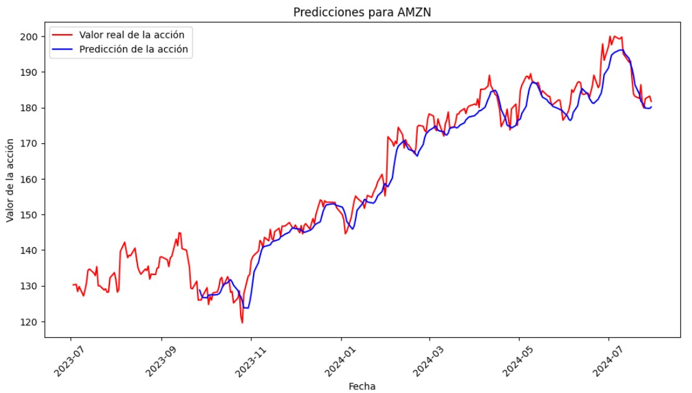
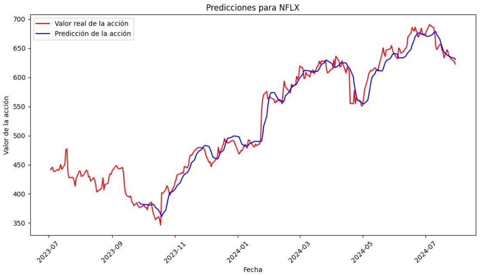
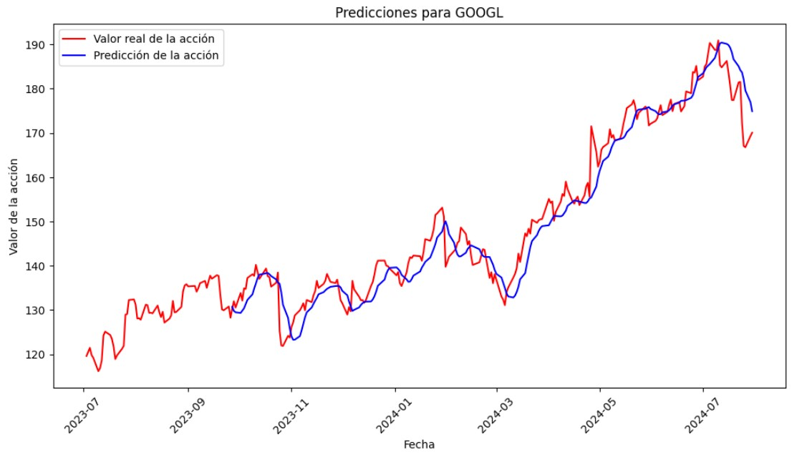
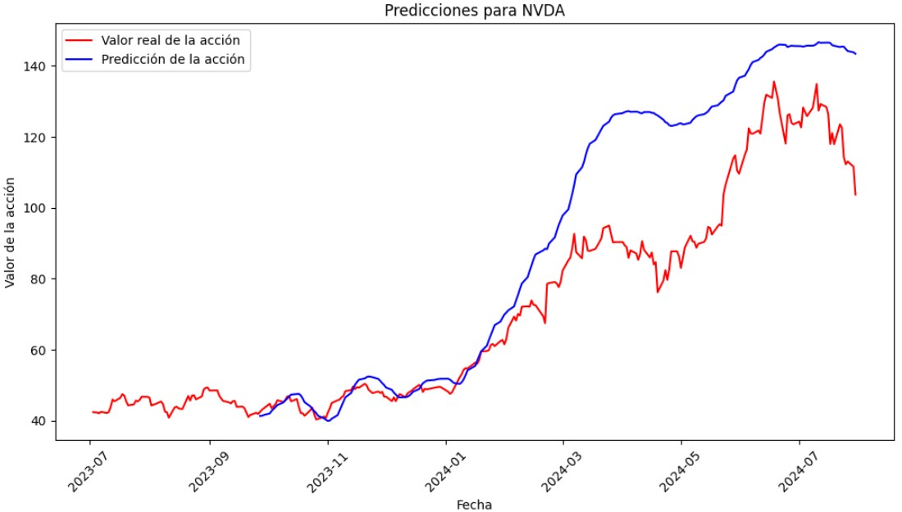
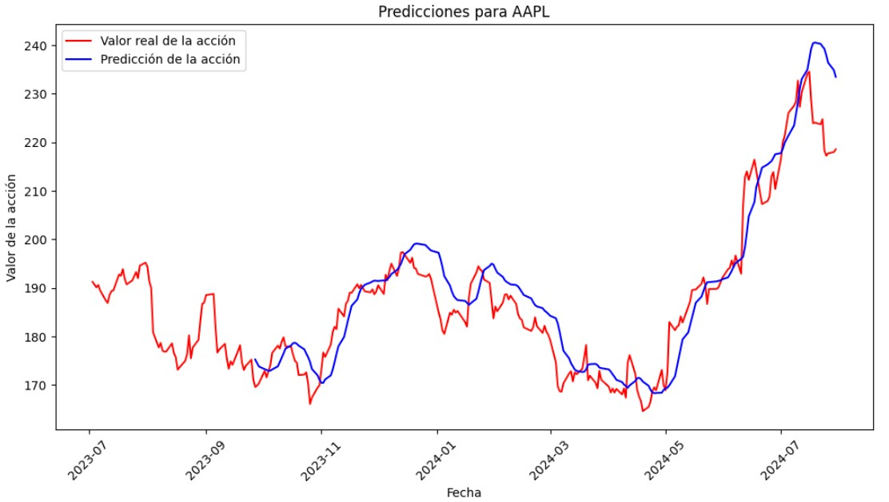
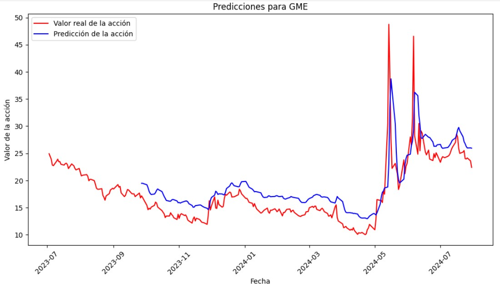


## Incorporación del Análisis de Sentimientos

Para mejorar la precisión de las predicciones, se incorporó el análisis de sentimientos de noticias financieras y reacciones en reddir, utilizando la herramienta **VADER**.

### Extracción y Procesamiento de Noticias

Las pruebas inciales se realizaron con el ticker de APLE:
```python
def obtener_noticias_yfinance(ticker):
    stock = yf.Ticker(ticker)
    noticias = stock.news
    return noticias
```
Fecha: 1726263919
Fuente: Zacks
Titulo: Apple (AAPL) Stock Drops Despite Market Gains: Important Facts to Note
Enlace: https://finance.yahoo.com/news/apple-aapl-stock-drops-despite-214519779.html

Fecha: 1726257850
Fuente: Investor's Business Daily
Titulo: Apple Begins Taking Preorders For AI-Enabled iPhone 16 Handsets
Enlace: https://finance.yahoo.com/m/b92b0d3f-72c2-35ce-ad46-c9a1915b22cf/apple-begins-taking-preorders.html

Fecha: 1726249762
Fuente: MT Newswires
Titulo: Apple Seeks Dismissal of Lawsuit Against Israeli Cyber Intelligence Firm NSO Group
Enlace: https://finance.yahoo.com/news/apple-seeks-dismissal-lawsuit-against-174922373.html

Fecha: 1726248205
Fuente: Investopedia
Titulo: FDA Approves OTC Hearing Aid Software Device for Apple AirPods Pro
Enlace: https://finance.yahoo.com/m/501763bd-b8a2-353f-b37c-be2380783f4a/fda-approves-otc-hearing-aid.html

Fecha: 1726246621
Fuente: TechCrunch
Titulo: Alternative app stores will be allowed on Apple iPad in the EU from September 16
Enlace: https://finance.yahoo.com/m/549ea22f-7f66-3ccb-9a29-cd6c091ea746/alternative-app-stores-will.html

```python
# Obtener publicaciones de reddit
import nest_asyncio
import asyncio
import asyncpraw

nest_asyncio.apply()

async def obtener_reddit_async(ticker, cliente_id, cliente_secret, usuario, contraseña, user_agent, subreddit='WallStreetBets', limite=100):
    reddit = asyncpraw.Reddit(client_id=cliente_id,
                              client_secret=cliente_secret,
                              user_agent=user_agent,
                              username=usuario,
                              password=contraseña)

    subreddit = await reddit.subreddit(subreddit)
    publicaciones = subreddit.search(ticker, limit=limite)
    datos = []
    async for post in publicaciones:
        datos.append({
            'titulo': post.title,
            'cuerpo': post.selftext,
            'fecha': post.created_utc
        })
    return datos

# Ejecutar la función asíncrona
cliente_id = "xxx"
cliente_secret = "xxx"
usuario = "xxx"
contraseña = "xxx"
user_agent = "xxx"

# Ejecutar la función para obtener los posts de Reddit de AAPL
reddit_posts = asyncio.run(obtener_reddit_async(ticker, cliente_id, cliente_secret, usuario, contraseña, user_agent))

# Mostrar un resumen de los primeros posts obtenidos
for post in reddit_posts[:5]:
    print(f"Fecha: {post['fecha']}")
    print(f"Título: {post['titulo']}")
    print(f"Cuerpo: {post['cuerpo']}\n")
```
Fecha: 1724950083.0

Título: AAPL; please stay up this time to keep over 7 figures

Cuerpo: 

Fecha: 1722691855.0

Título: My theory why buffet sold aapl

Cuerpo: Everyone is freaking out about recession and also citing buffet selling half his stake in aapl as proof. But the reality is buffet doesn't time the market he holds good companies through recessions. But if you look at a lot of his other moves, sold all his TSM and a large portion of BYD as well. Its 

clear that buffet has geopolitical risks on the top of his mind, aapl would be obliterated in the case of a taiwan war. 

Afterall, why wouldn't he sell his American express position in a material way, wouldn't they get hit hard in a recession as well with delinquencies and decreased consumer spending? 

I guess this post doesn't really offer much reassurance as a taiwan war would be worse than a recession. But honestly I think you should trade like it wouldn't happen because if it does it would probably devolve into nuclear war and currency would be irrelevant at that point. Just my 2 cents.

Fecha: 1722348117.0

Título: aapl earnings YOLO

Cuerpo: I am a regard but maybe we’ll be lucky also I have no reasoning just hoping for good earnings 

###  Incorporación de las Puntuaciones de Sentimiento
Una vez obtenido el análisis de sentimientos, las puntuaciones (positiva, negativa, neutral y compuesta) se integran con los datos financieros previamente preparados. Este conjunto de datos combinado sirve como entrada al modelo LSTM.

Fecha: 2024-09-13 21:45:19, Sentimiento: -0.6671, Titulo: Apple (AAPL) Stock Drops Despite Market Gains: Important Facts to Note

Fecha: 2024-09-13 20:04:10, Sentimiento: 0.0, Titulo: Apple Begins Taking Preorders For AI-Enabled iPhone 16 Handsets

Fecha: 2024-09-13 17:49:22, Sentimiento: 0.296, Titulo: Apple Seeks Dismissal of Lawsuit Against Israeli Cyber Intelligence Firm NSO Group

Fecha: 2024-08-29 16:48:03, Sentimiento: 0.3182, Título: AAPL; please stay up this time to keep over 7 figures

Fecha: 2024-08-03 13:30:55, Sentimiento: -0.9488, Título: My theory why buffet sold aapl

Fecha: 2024-07-30 14:01:57, Sentimiento: 0.8625, Título: aapl earnings YOLO

###  Impacto del Análisis de Sentimientos en la Predicción
Incorporar los datos de sentimientos permitió mejorar la precisión del modelo al capturar el impacto de las noticias en el comportamiento del mercado. Los gráficos siguientes comparan las predicciones de dos modelos: uno que utiliza únicamente datos financieros y otro que incorpora el análisis de sentimientos.

<div style="display: flex; justify-content: space-between; flex-wrap: wrap;">
  
  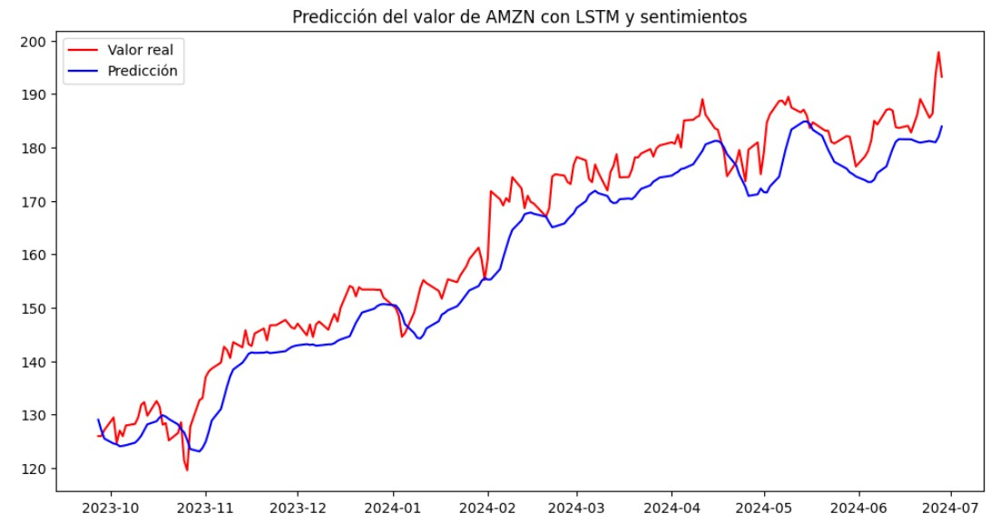
  
  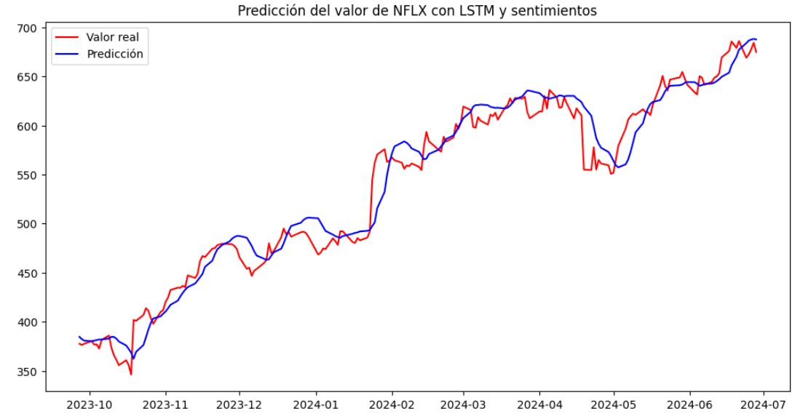
  
  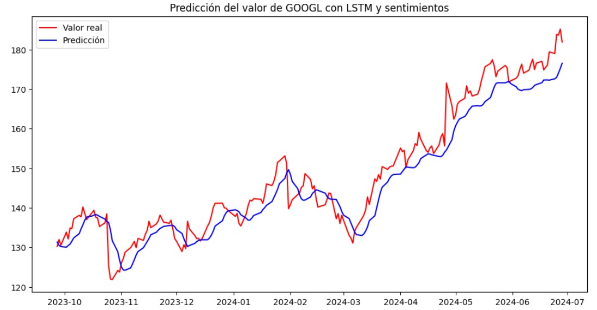
  
  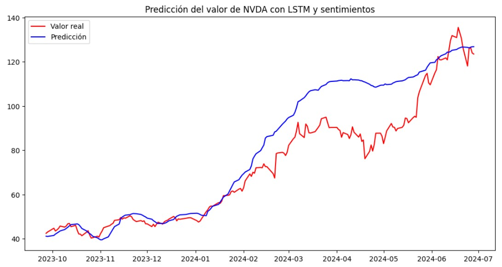
  
  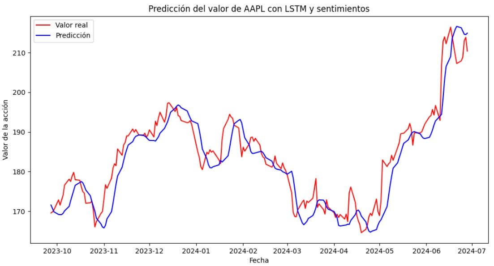
  
  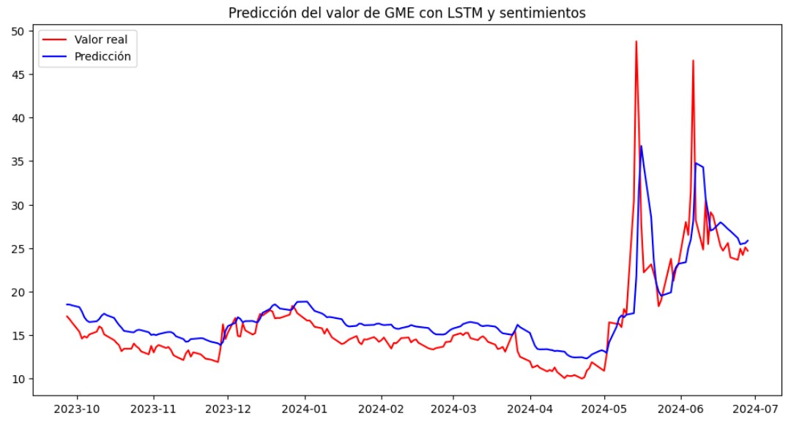
</div>


## Comparación de Modelos: Métrica MSE

En la tabla siguiente se muestran los resultados del **Error Cuadrático Medio (MSE)** para todas las acciones, comparando el Modelo 1 (solo datos financieros) y el Modelo 2 (datos financieros + análisis de sentimientos).

| Acción  | MSE (M1)   | MSE (M2)   |
|---------|------------|------------|
| AAPL    |  38.080    |  23.505    |
| AMZN    |  14.764    |  17.555    |
| GOOGL   |  18.694    |  20.392    |
| NVDA    | 455.809    |  26.863    |
| NFLX    | 267.251    | 340.965    |
| GME     |  14.362    |  16.942    |


## Comparación de Modelos: Métrica R²


| Acción  | R²         | R² (con PNL) |
|---------|------------|--------------|
| AAPL    | 0.8614     | 0.8263       |
| AMZN    | 0.9669     | 0.9576       |
| GOOGL   | 0.9443     | 0.9217       |
| NVDA    | 0.4540     | 0.9604       |
| NFLX    | 0.9698     | 0.9596       |
| GME     | 0.6126     | 0.4947       |


## Pruebas adicionales
Se realizaro algunas pruebas para intentar optimizar el modelo que incluyeron:
Ajuste del tamaño de las capas ocultas
Tuning del learning rate
Incorporar Dropout
Early Stopping
Aumento de epocas

sin embargo el desempeño no mejoro en ninguno de lo casos, lo que indica que al complejizarse las red probablemente se genera overfitting y ruido que impide la mejora.

## CONSTRUCCION DEL PORTAFOLIO

Finalmente como parte de este proyecto, construimos un portafolio de inversion en base a las predicciones de un mes calculando los rendimientos diarios y la volatilidad de cada accion y en base a una optimizacion de pesos con el criterio del ratio de sharpe, la distribucion optima nos queda de la siguiente manera:

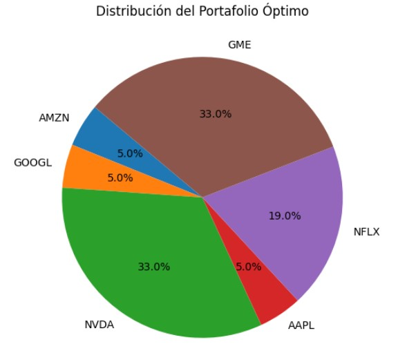


## Conclusiones

Este proyecto presentó un enfoque para la predicción del precio de acciones utilizando redes LSTM y combinando datos financieros con análisis de sentimientos de noticias. A lo largo del proceso, se implementaron y compararon dos modelos principales:

1. **Modelo 1**: Basado únicamente en datos financieros históricos.
2. **Modelo 2**: Basado en datos financieros y análisis de sentimientos de noticias.

Impacto mixto del análisis de sentimientos: El Modelo 2 mejoró las predicciones para algunas acciones como NVDA y AAPL, pero empeoró para otras como AMZN, GOOGL, NFLX, y GME. Esto indica que el análisis de sentimientos puede ser beneficioso en ciertos contextos, pero en otros, puede no ser tan relevante o incluso contraproducente.

En acciones como NVDA, que han mostrado alta volatilidad en el mercado, el Modelo 2 ofrece una mejora significativa en comparación con el Modelo 1, lo que sugiere que el análisis de sentimientos puede ayudar a capturar mejor las fluctuaciones en acciones más volátiles.

Para algunas acciones, la diferencia entre los modelos es menor, lo que sugiere que el análisis de sentimientos no añade mucho valor en estas situaciones, y los datos financieros históricos pueden ser suficientes para realizar predicciones precisas.


## Trabajo Futuro

1. **Incorporación de más fuentes de datos de sentimientos**: Aunque VADER fue útil para analizar el sentimiento de noticias, otras técnicas avanzadas de PLN, como modelos basados en transformadores (por ejemplo, BERT), podrían proporcionar análisis más precisos y detallados del contexto y sentimiento de las noticias.
2. **Optimización de Hiperparámetros**: Podría realizarse un ajuste más detallado de los hiperparámetros del modelo LSTM, como el tamaño del lote, el número de capas y las tasas de aprendizaje, utilizando técnicas como grid search u optimización bayesiana.
3. **Posibles mejoras**: Dado que el análisis de sentimientos no ha funcionado de manera consistente en todas las acciones, sería útil explorar otras fuentes de datos o enfoques para incorporar el análisis de sentimientos (por ejemplo, usando otro modelo de análisis de sentimientos más avanzado o ajustando el preprocesamiento de los datos de noticias).
4. **Análisis de Sentimientos en Redes Sociales**: Además de las noticias, incorporar datos de redes sociales como X o plataformas especializadas, que tienen un impacto significativo en los mercados financieros, podría mejorar aún más las predicciones.
   
En resumen, el Modelo 2 muestra una mejora notable en algunas acciones (particularmente las más volátiles), pero no en todas. Es importante analizar cada acción individualmente y considerar otros factores para mejorar el rendimiento general del modelo que incluye el análisis de sentimientos.

---
