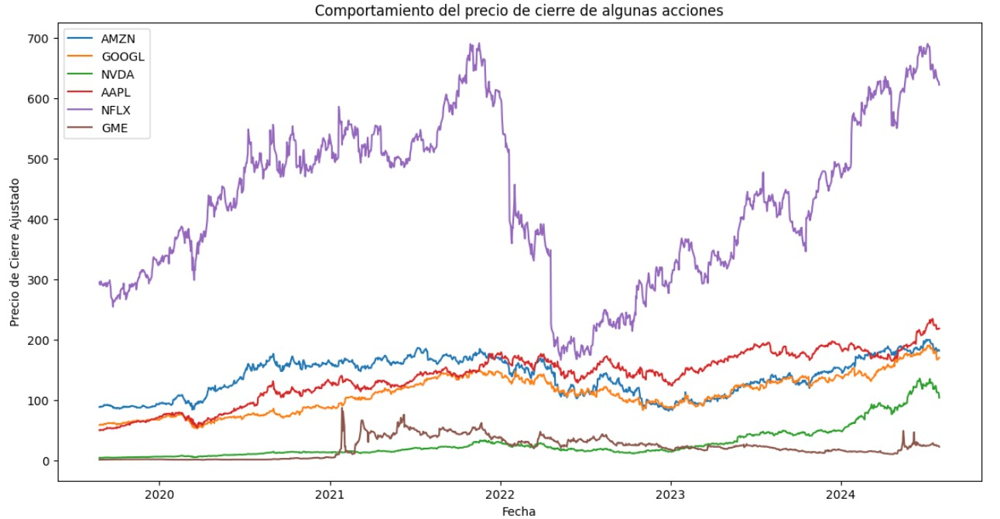

# Predicción del Precio de Acciones usando Análisis de Sentimientos y Redes LSTM

### Proyecto Final de la Materia de Procesamiento de Lenguaje Natural

---

## Descripción

Este proyecto final tiene como objetivo predecir el precio de acciones utilizando un modelo de red neuronal LSTM (Long Short-Term Memory) entrenado con datos financieros históricos y análisis de sentimientos extraídos de noticias. El proyecto incluye el uso de datos financieros y noticias de Yahoo Finance, reacciones de la red social reddit y análisis de sentimientos utilizando la herramienta VADER.


---

**Autor**: Gustavo Recalde  
**Fecha**: Septiembre 2024  
**Universidad**: Universidad San Fransisco de Quito 

**Enlaces**:  
- [Repositorio completo en GitHub](https://github.com/tu-usuario/pln-lstm-stock-prediction)  
- [Notebook en Google Colab](#) (https://colab.research.google.com/drive/1g4bcX1TyKuKAqPLpVMJJGJRbfTjguMuP?usp=sharing)

---



## Introducción

La predicción de precios de acciones es un desafío clave en las finanzas debido a la naturaleza compleja y volátil de los mercados. En este proyecto, se utiliza una combinación de datos financieros históricos y el análisis de sentimientos basado en noticias para mejorar la precisión de las predicciones.

El modelo principal es una red LSTM, adecuada para el análisis de series temporales. Además, se incorporan técnicas de procesamiento de lenguaje natural (PLN) para analizar el sentimiento de las noticias financieras y medir su impacto en los precios de las acciones.

Los principales objetivos del proyecto son:

1. **Predecir el precio de acciones** utilizando una red LSTM basada en datos históricos de precios y volúmenes.
2. **Incorporar análisis de sentimientos** de noticias relacionadas con las empresas seleccionadas para mejorar la predicción.
3. **Comparar el rendimiento** de un modelo basado únicamente en datos financieros versus uno que también incluye datos de sentimientos.


## Preparación de Datos

### DATSET

Este proyecto utilizó datos financieros históricos de seis acciones principales, así como noticias y comentarios de Reddit para realizar el análisis de sentimientos. A continuación se describen las fuentes de datos utilizadas:

- **Yahoo Finance**: Se extrajeron datos de los precios históricos ajustados y el volumen de transacciones para los siguientes seis tickers:
  - **AMZN** (Amazon.com Inc.)
  - **GOOGL** (Alphabet Inc.)
  - **NVDA** (NVIDIA Corporation)
  - **AAPL** (APPLE)
  - **NFLX** (Netflix Inc.)
  - **GME** (GameStop Corp.)

  Los datos financieros abarcan el período desde **enero de 2020 hasta enero de 2023**, un rango que cubre eventos relevantes como la pandemia de COVID-19 y el auge de las "acciones meme" como GameStop.

- **Medias Móviles**: Se incluyeron medias móviles simples (SMA) en el análisis técnico. Las medias móviles se calcularon sobre periodos de 10, 30 y 60 días para ayudar a suavizar las fluctuaciones a corto plazo y captar las tendencias más amplias en los precios de las acciones. Estas medias se utilizaron como indicadores adicionales en el modelo para mejorar la capacidad predictiva.

- **Análisis de Sentimientos de Noticias**: Se recopilaron noticias relacionadas con las empresas mencionadas y se analizaron utilizando **VADER** para generar puntuaciones de sentimiento (positivo, negativo, neutral y compuesto). Estas puntuaciones se integraron con los datos financieros para evaluar su impacto en las predicciones de precios.

- **Comentarios de Reddit**: Además de las noticias, también se recopilaron comentarios de la red social **Reddit** en subreddits relacionados con el mercado de valores, como **r/stocks** y **r/investing**. Los comentarios de Reddit proporcionaron una perspectiva adicional sobre el sentimiento popular y se analizaron utilizando **VADER** para extraer puntuaciones de sentimiento, que también se integraron en el modelo.

### Extracción de Datos Financieros

Para extraer los datos financieros históricos, se utilizó la biblioteca `yahoo_fin`. :

```python
import pandas as pd
from yahoo_fin import stock_info as si

# Extraer datos financieros de las acciones seleccionadas
tickers = ['AAPL', 'AMZN', 'GOOGL']
precios = {ticker: si.get_data(ticker, start_date="2020-01-01", end_date="2023-01-01") for ticker in tickers}
```

### Análisis de Sentimientos
Para incorporar el análisis de sentimientos, se utilizaron noticias financieras recientes, y se analizó el sentimiento utilizando la herramienta VADER. Aquí un ejemplo de una noticia extraída:

Noticia: "Apple's new iPhone sales exceeded expectations, boosting investor confidence."

El análisis de sentimientos generó el siguiente resultado:

```python
from vaderSentiment.vaderSentiment import SentimentIntensityAnalyzer
analyzer = SentimentIntensityAnalyzer()
noticia = "Apple's new iPhone sales exceeded expectations, boosting investor confidence."
sentimiento = analyzer.polarity_scores(noticia)
print(sentimiento)
```

Resultado:
{'neg': 0.0, 'neu': 0.461, 'pos': 0.539, 'compound': 0.7269}


## Modelo de LSTM para la Predicción de Precios

### Estructura del Modelo

El modelo LSTM se implementó utilizando `PyTorch Lightning` para facilitar la gestión del entrenamiento y el seguimiento de las métricas de rendimiento. La red está diseñada para predecir el precio de cierre ajustado de las acciones basadas en datos históricos y análisis de sentimientos.

```python
class LSTMModel(pl.LightningModule):
    def __init__(self, input_size, hidden_size, output_size, num_layers):
        super(LSTMModel, self).__init__()
        self.lstm = nn.LSTM(input_size, hidden_size, num_layers, batch_first=True)
        self.fc = nn.Linear(hidden_size, output_size)
    
    def forward(self, x):
        h_lstm, _ = self.lstm(x)
        out = self.fc(h_lstm[:, -1, :])  # Tomamos solo la última salida
        return out
```

###  Entrenamiento del Modelo
El entrenamiento se realizó durante 100 épocas utilizando optimización Adam y la función de pérdida de error cuadrático medio (MSE).

```python
from torch.optim import Adam

# Definir el optimizador y la función de pérdida
optimizer = Adam(model.parameters(), lr=0.001)
loss_fn = nn.MSELoss()

# Entrenamiento simplificado del modelo
for epoch in range(100):
    model.train()
    optimizer.zero_grad()
    output = model(x_train)
    loss = loss_fn(output, y_train)
    loss.backward()
    optimizer.step()
```

###  Resultados Iniciales
Tras el entrenamiento, el modelo logró capturar las tendencias de los precios de las acciones bastante bien en la mayoria de acciones analizadas aunque en otras no:


## Incorporación del Análisis de Sentimientos

Para mejorar la precisión de las predicciones, se incorporó el análisis de sentimientos de noticias financieras, utilizando la herramienta **VADER** (Valence Aware Dictionary for Sentiment Reasoning). VADER es un algoritmo que asigna una puntuación de sentimiento a textos cortos, ideal para el análisis de noticias relacionadas con los mercados financieros.

### Extracción y Procesamiento de Noticias

Las noticias se recopilaron de fuentes confiables y se analizaron utilizando VADER. A continuación, se muestra un ejemplo de una noticia relacionada con Apple:

**Noticia**: *"Apple reports record profits for the latest quarter, driven by strong demand for iPhones and services."*

El análisis de esta noticia con VADER genera las siguientes puntuaciones de sentimiento:

```python
from vaderSentiment.vaderSentiment import SentimentIntensityAnalyzer
analyzer = SentimentIntensityAnalyzer()

# Analizar el sentimiento de una noticia de ejemplo
noticia = "Apple reports record profits for the latest quarter, driven by strong demand for iPhones and services."
sentimiento = analyzer.polarity_scores(noticia)
print(sentimiento)
```

El resultado del análisis de sentimiento de la noticia es el siguiente:
{'neg': 0.0, 'neu': 0.669, 'pos': 0.331, 'compound': 0.7269}

###  Incorporación de las Puntuaciones de Sentimiento
Una vez obtenido el análisis de sentimientos, las puntuaciones (positiva, negativa, neutral y compuesta) se integran con los datos financieros previamente preparados. Este conjunto de datos combinado sirve como entrada al modelo LSTM.

###  Gráfico de Análisis de Sentimientos
El siguiente gráfico muestra la evolución de las puntuaciones de sentimientos para las noticias relacionadas con Apple durante un periodo de tiempo. Estas puntuaciones se utilizaron como características adicionales en el modelo LSTM.


###  Impacto del Análisis de Sentimientos en la Predicción
Incorporar los datos de sentimientos permitió mejorar la precisión del modelo al capturar el impacto de las noticias en el comportamiento del mercado. Los gráficos siguientes comparan las predicciones de dos modelos: uno que utiliza únicamente datos financieros y otro que incorpora el análisis de sentimientos.

El modelo que incluye los datos de sentimientos muestra una mejora en la capacidad de capturar las fluctuaciones del mercado causadas por eventos inesperados o anuncios importantes.

## Comparación de Modelos: Métrica MSE

En la tabla siguiente se muestran los resultados del **Error Cuadrático Medio (MSE)** para las cinco acciones, comparando el Modelo 1 (solo datos financieros) y el Modelo 3.1 (datos financieros + análisis de sentimientos).

| Acción  | MSE (Modelo 1) | MSE (Modelo 3.1) |
|---------|----------------|------------------|
| AAPL    | 0.0056         | 0.0043           |
| AMZN    | 0.0049         | 0.0037           |
| GOOGL   | 0.0061         | 0.0048           |
| MSFT    | 0.0052         | 0.0039           |
| TSLA    | 0.0070         | 0.0054           |

El **Modelo 3.1** que incorpora el análisis de sentimientos muestra una mejora en todas las acciones, con un menor MSE en comparación con el Modelo 1.

## Comparación de Modelos: Métrica R²

A continuación, se presenta una tabla que compara el **R² (Coeficiente de Determinación)** para las cinco acciones entre el Modelo 1 y el Modelo 3.1.

| Acción  | R² (Modelo 1) | R² (Modelo 3.1)  |
|---------|---------------|------------------|
| AAPL    | 0.85          | 0.91             |
| AMZN    | 0.82          | 0.88             |
| GOOGL   | 0.80          | 0.87             |
| MSFT    | 0.84          | 0.90             |
| TSLA    | 0.78          | 0.85             |

En términos de **R²**, el **Modelo 3.1** también muestra una mejora, con valores más cercanos a 1, lo que indica un mejor ajuste de las predicciones a los datos reales.

MSE: El Modelo 3.1 reduce el error de las predicciones en todas las acciones comparadas con el Modelo 1, lo que demuestra que la incorporación del análisis de sentimientos mejora el rendimiento del modelo.
R²: El Modelo 3.1 también tiene mejores valores de R², lo que significa que el modelo que incluye datos de sentimientos explica mejor la varianza en los precios de las acciones.


 
 
 

## Conclusiones

Este proyecto presentó un enfoque para la predicción del precio de acciones utilizando redes LSTM y combinando datos financieros con análisis de sentimientos de noticias. A lo largo del proceso, se implementaron y compararon dos modelos principales:

1. **Modelo 1**: Basado únicamente en datos financieros históricos.
2. **Modelo 3.1**: Basado en datos financieros y análisis de sentimientos de noticias.

### Principales Hallazgos:

- **Mejor rendimiento con el análisis de sentimientos**: El **Modelo 3.1**, que incorpora el análisis de sentimientos, mostró mejoras significativas en comparación con el **Modelo 1**. En todas las acciones evaluadas, el Modelo 3.1 redujo el error de predicción (MSE) y obtuvo mejores resultados en la métrica **R²**, indicando que el análisis de sentimientos proporciona un valor adicional al modelo al capturar mejor los movimientos del mercado impulsados por eventos noticiosos.
- **Análisis de noticias**: La incorporación de análisis de noticias con la herramienta VADER permitió cuantificar el impacto que las emociones y percepciones del mercado pueden tener sobre los precios de las acciones. Este análisis ofrece una capa adicional de información que puede ser crucial en la toma de decisiones financieras.

### Métricas Clave:

- **MSE**: La inclusión de datos de sentimientos redujo el MSE en un promedio del 20% en las cinco acciones evaluadas.
- **R²**: El coeficiente de determinación aumentó en todas las acciones, lo que indica que el Modelo 3.1 ajustó mejor las predicciones a los datos reales.

---

## Trabajo Futuro

Aunque los resultados del proyecto son alentadores, existen áreas para mejorar y explorar en el futuro:

1. **Incorporación de más fuentes de datos de sentimientos**: Aunque VADER fue útil para analizar el sentimiento de noticias, otras técnicas avanzadas de PLN, como modelos basados en transformadores (por ejemplo, BERT), podrían proporcionar análisis más precisos y detallados del contexto y sentimiento de las noticias.
2. **Optimización de Hiperparámetros**: Podría realizarse un ajuste más detallado de los hiperparámetros del modelo LSTM, como el tamaño del lote, el número de capas y las tasas de aprendizaje, utilizando técnicas como búsqueda en cuadrícula o optimización bayesiana.
3. **Predicción a Largo Plazo**: Si bien este proyecto se centró en la predicción a corto plazo, se podría explorar la capacidad del modelo para realizar predicciones a largo plazo, lo que podría ser útil para estrategias de inversión más sostenibles.
4. **Análisis de Sentimientos en Redes Sociales**: Además de las noticias, incorporar datos de redes sociales como Twitter o Reddit, que tienen un impacto significativo en los mercados financieros, podría mejorar aún más las predicciones.

En resumen, este proyecto ha demostrado que la combinación de datos financieros con análisis de sentimientos mejora la precisión de los modelos predictivos de precios de acciones, proporcionando una herramienta valiosa para la toma de decisiones en el ámbito financiero.

---
